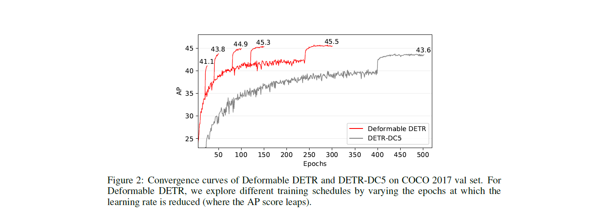

# Deformable DETR

By [Xizhou Zhu](https://scholar.google.com/citations?user=02RXI00AAAAJ),  [Weijie Su](https://www.weijiesu.com/),  [Lewei Lu](https://www.linkedin.com/in/lewei-lu-94015977/), [Bin Li](http://staff.ustc.edu.cn/~binli/), [Xiaogang Wang](http://www.ee.cuhk.edu.hk/~xgwang/), [Jifeng Dai](https://jifengdai.org/).

This repository is an official implementation of the paper [Deformable DETR: Deformable Transformers for End-to-End Object Detection](https://arxiv.org/abs/2010.04159).


## Introduction

**TL; DR.** Deformable DETR is an efficient and fast-converging end-to-end object detector. It mitigates the high complexity and slow convergence issues of DETR via a novel sampling-based efficient attention mechanism.  




**Abstract.** DETR has been recently proposed to eliminate the need for many hand-designed components in object detection while demonstrating good performance. However, it suffers from slow convergence and limited feature spatial resolution, due to the limitation of Transformer attention modules in processing image feature maps. To mitigate these issues, we proposed Deformable DETR, whose attention modules only attend to a small set of key sampling points around a reference. Deformable DETR can achieve better performance than DETR (especially on small objects) with 10× less training epochs. Extensive experiments on the COCO benchmark demonstrate the effectiveness of our approach.

## Installation

### PYTHONPATH
export PYTHONPATH=$PYTHONPATH:/workspace/source/E2E-AD/ours_v3/TCP/Deformable_DETR

### Requirements

* Linux, CUDA>=9.2, GCC>=5.4
  
* Python>=3.7

    We recommend you to use Anaconda to create a conda environment:
    ```bash
    conda create -n deformable_detr python=3.7 pip
    ```
    Then, activate the environment:
    ```bash
    conda activate deformable_detr
    ```
  
* PyTorch>=1.5.1, torchvision>=0.6.1 (following instructions [here](https://pytorch.org/))

    For example, if your CUDA version is 9.2, you could install pytorch and torchvision as following:
    ```bash
    conda install pytorch=1.5.1 torchvision=0.6.1 cudatoolkit=9.2 -c pytorch
    ```
  
* Other requirements
    ```bash
    pip install -r requirements.txt
    ```

### Compiling CUDA operators
```bash
cd ./models/ops
sh ./make.sh
# unit test (should see all checking is True)
python test.py
```

## Usage

### Dataset preparation

Please download [COCO 2017 dataset](https://cocodataset.org/) and organize them as following:

```
code_root/
└── data/
    └── coco/
        ├── train2017/
        ├── val2017/
        └── annotations/
        	├── instances_train2017.json
        	└── instances_val2017.json
```

### Training

#### Training on single node

For example, the command for training Deformable DETR on 8 GPUs is as following:

```bash
GPUS_PER_NODE=8 ./tools/run_dist_launch.sh 8 ./configs/r50_deformable_detr.sh
```

#### Training on multiple nodes

For example, the command for training Deformable DETR on 2 nodes of each with 8 GPUs is as following:

On node 1:

```bash
MASTER_ADDR=<IP address of node 1> NODE_RANK=0 GPUS_PER_NODE=8 ./tools/run_dist_launch.sh 16 ./configs/r50_deformable_detr.sh
```

On node 2:

```bash
MASTER_ADDR=<IP address of node 1> NODE_RANK=1 GPUS_PER_NODE=8 ./tools/run_dist_launch.sh 16 ./configs/r50_deformable_detr.sh
```

#### Training on slurm cluster

If you are using slurm cluster, you can simply run the following command to train on 1 node with 8 GPUs:

```bash
GPUS_PER_NODE=8 ./tools/run_dist_slurm.sh <partition> deformable_detr 8 configs/r50_deformable_detr.sh
```

Or 2 nodes of  each with 8 GPUs:

```bash
GPUS_PER_NODE=8 ./tools/run_dist_slurm.sh <partition> deformable_detr 16 configs/r50_deformable_detr.sh
```
#### Some tips to speed-up training
* If your file system is slow to read images, you may consider enabling '--cache_mode' option to load whole dataset into memory at the beginning of training.
* You may increase the batch size to maximize the GPU utilization, according to GPU memory of yours, e.g., set '--batch_size 3' or '--batch_size 4'.

### Evaluation

You can get the config file and pretrained model of Deformable DETR (the link is in "Main Results" session), then run following command to evaluate it on COCO 2017 validation set:

```bash
<path to config file> --resume <path to pre-trained model> --eval
```

You can also run distributed evaluation by using ```./tools/run_dist_launch.sh``` or ```./tools/run_dist_slurm.sh```.
